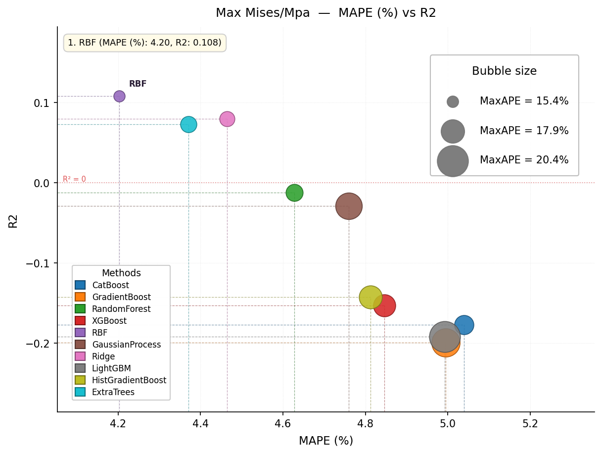

# Machine Learning Data Fitting 

### Introduction

This lib provide a **multiple-type quick data fitting (Regression) and model predicting** using  of Machine Learning Python libraries, 

It's designed for `ready-to-use`, and you can perform all the `fit-validation` and `train-test` process within 50 lines of code.  


Currently Supported Models : 

```python
SUPPORTED_METHODS = [
    'CatBoost', 'GradientBoost', 'RandomForest',
    'XGBoost', 'RBF', 'GaussianProcess', 'Ridge',
    'LightGBM', 'HistGradientBoost', 'ExtraTrees',
]
```


## Usage & Tutorial 

### 1) Import this library

To use this library, you should prepare you data `x` and `y`, also you can specify the name of `x` as `feature_names` 


```python
import time
import pandas as pd
import os
from ml_data_fitting import (
    run_regression_eval,
    plot_eval_results,
    save_eval_to_excel,
    fast_fit_predict,
    save_all_pred_data,
    generate_train_test_data,
    compute_target_cvs_dict,
    load_train_test_data,
)
```

Then write a function to read `x` and `y` : 

```python
def load_data():
    ... 
    return x, y
```

Then specify the method you use : 

```python
METHODS = None  # use None for all methods  
```

### 2) Load your data 

use `generate_train_test_data` to generate initial dataset. 

```python
def main():
    """
    Main function to fit models and plot results
    """
    save_base_dir = "results"
    ########## only split x and y on the first run ###################
    x, y = load_data()
    x_train, y_train, x_test, y_test, feature_names, target_names = generate_train_test_data(
        x, y, feature_names=x.columns.tolist(), target_names=y.columns.tolist(),
        filename="train_test_data.pkl", random_state=int(time.time()),
    )
    ########### or you can  load the data by following ########## 
    # Generate train-test split
    # x_train, y_train, x_test, y_test, feature_names, target_names = load_train_test_data(filename="train_test_data.pkl")
    
	# then if you need to normalize inputs, you should normalize it : 
    x_arr, y_arr = np.array(x), np.array(y)
	x_arr = normalize_inputs(x_arr) 
    ... # validation and train-test
```

### 3) Do Validations

You can do all evaluation works within 15 lines : 

-  Note we train different model for different columns on `y` 

```python
    # ============================= EVAL PROCESS ====================
    results = run_regression_eval(
        x_train, y_train,
        feature_names=feature_names,
        target_names=target_names,
        methods=METHODS,
        max_iterations=1000,
        save_path="model_selection.json",
    )
    # Plot evaluation results
    save_eval_to_excel(results, filename="prediction_data.xlsx")
    cvs_dict = compute_target_cvs_dict(y=y_train, targets=target_names)
    plot_eval_results(results, target_cvs=cvs_dict, output_dir=f"{save_base_dir}/MAPE_Pearson_r")
    # ======================= EVAL PROCESS END ==================
```

Note: `target_cvs` and `cv_threshold` is used for automatically changing `R2 score` to `Pierson-r` for low CV data. if you always want R2 Loss, just pass `target_cvs=None`. 

This will give the following validation plot :  



This plot shows how well these methods perform, the `top-left point in R2-MAPE` Curve is often the best model. which is `RBF` in this picture. 

### 4) Run a test on the test dataset

If your $y$ has multiple lines, you should split it when pass to `fast_fit_predict` 

```python
# ============== Test on test set ========================
for idx, column in enumerate(["R1", "R2"]):
    train_preds_dict, test_preds_dict = fast_fit_predict(
        x_train=x_train,
        y_train=y_train[:, idx],
        x_test=x_test,
        methods=METHODS,
        max_iterations=2000
    )
    save_all_pred_data(
        y_true_dict= {
            "train": y_train[:, idx],
            "test": y_test[:, idx],
        },
        y_train_dict= train_preds_dict,
        y_test_dict= test_preds_dict,
        data_name=column,
        acc_threshold=[0.05, 0.1, 0.15, 0.2],
        result_base_dir=save_base_dir,
        tol_acc_threshold_range=(0.01, 0.20),
        tol_acc_threshold_steps=20,
    )
# ================= END Train and test on test set ========================
```

Then all data will be saved correctly on the result directory. And you can plot these data later like this : 


